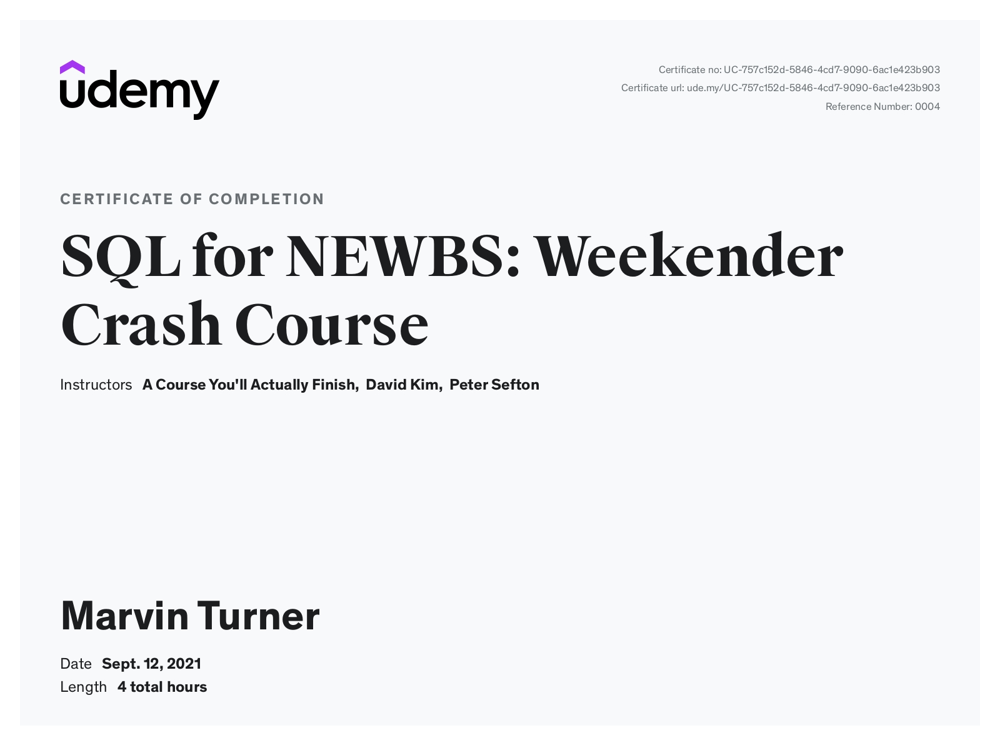

# SQL Crash Course
Exercise solutions from [SQL Weekender Crash Course](https://www.udemy.com/course/sql-for-newbs/). Took this to touch up SQL knowledge. Very informative and Engaging, Starts from `SELECT *` and works up to creating `temporary table`s and `JOIN`s

